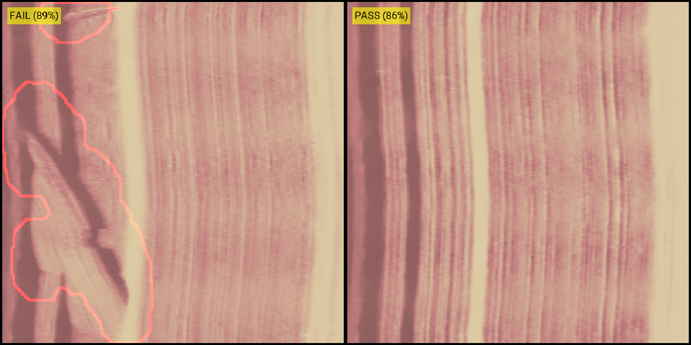
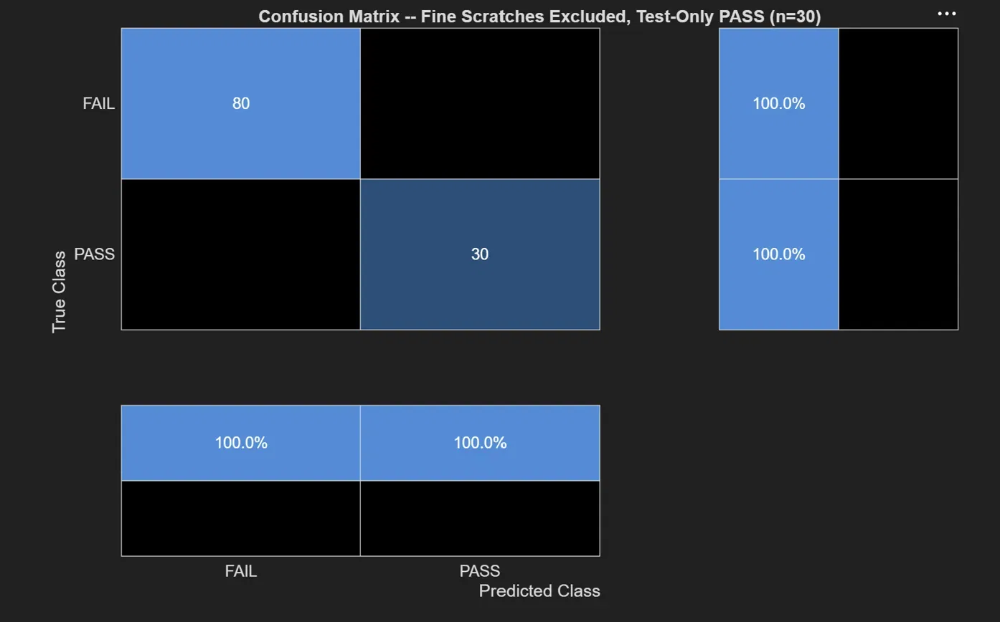

# Defect Detection Pipeline for Wood Grain Dataset
**Group 8 — Internship Project**

<figure>
  
  <figcaption><em>Two separate inspectPart.m runs shown side-by-side: a defective image (left) and a clean image (right), each displaying the evidence overlay, decision, and confidence score</em></figcaption>
</figure>

## Overview:

This MATLAB project is an automated inspection station for detecting defects in wood grain textures. It combines classical image processing with an AI classifier to yield a final result.

The main function, `inspectPart.m`, returns:
- A **PASS**/**FAIL** classification decision
- A confidence score for that decision
- An evidence overlay image
- Supporting evidence metrics used as the basis for the decision

The pipeline is demonstrated through two live scripts. `DetailedInspectionPipeline.mlx` walks through every step of the single inspection function. From  scratch and brush masks, to evidence metrics, to AI classification, to override state, the script ends with the final image & verdict. `DefectDetectionReport.mlx` is the full project report: methodology, defect definitions, batch testing results across 230 images, and an analysis of design tradeoffs and open challenges. 


## Getting Started
This project is made entirely on MATLAB and requires MATLAB to open and run live scripts. For those who do not have MATLAB or wish to see the report without running the live script, there is a static version of the report. The complied findings,  methodology, results , analysis of design tradeoffs, and open challenges [can be viewed in this PDF](https://github.com/AndyV0/Defect-Detection-Pipeline---Wood-Grain/blob/main/Image-Based%20Defect%20Detection%20Report%20-%20G8.pdf). 

To run the live scripts yourself, follow the steps below

### Requirements
- MATLAB R2023b or later (for live script compatibility)
- MATLAB Computer Vision Toolbox
- MATLAB Deep Learning Toolbox
- MATLAB Image Processing Toolbox
- MATLAB Statistics and Machine Learning Toolbox

### How to Run
1. Clone the repo
   ```sh
   git clone https://github.com/AndyV0/Defect-Detection-Pipeline---Wood-Grain.git
   ```
2. Open the scripts/ folder and choose the live script you want to run 
3. In the live script, click 'Run All'

The script will execute top to bottom, displaying results, figures, and evidence 
metrics as it runs. 

> Running any of the live scripts will auto-download required `.mat` files 
> (trained models) on first execution, which may take a moment.   


## Repostitory Structure & Dataset

### Folder Structure
This is the code/data folders tree documenting all functions, folder, and .mat files present in this project (not including root config/doc files). Descriptions of what a file does are to the side of it's position.
```
Root
├───assets    # Image assest used in this README
├───functions
│   ├───Test and Train                              # Functions to test & train AI Classifier
│   │   ├───trainInspectionClassifier.m             # Trains the AI Classifier
│   │   └───fullDatasetBatchTest_noFineScratch.m    # Creates a batch test to test inspectPart.m
│   ├───classicalDetection                # Human-made Defect Detectors
│   │   ├───ringContinuityDetection.m     # Finds errors in 01 dataset's rings
│   │   ├───scratchDetection.m            # Finds scratch defects in 02 dataset
│   │   ├───hairlineScratchDetection.m    # Unused Detector meant for 02
│   │   ├───bleedDetection.m              # Finds bleeds in 03 dataset's ellipse
│   │   └───brushDetection.m              # Finds brush defects in 02 dataset (combines w/ scratch)
│   ├───AI-Based Segmentation          
│   │   ├───trainSegmentDefect.m    # Trains the AI to capture defect area
│   │   └───segmentDefect.m         # Produces maskAI (optional deliverable) 
│   └───inspectPart.m               # Main entry point — runs full inspection
├───imageSampleSets                       
│   ├───sample_test_01    # Sample of 20 images & masks for scripts
│   │   ├───masks
│   │   └───images
│   ├───sample_test_02    # This sample is used for all main deliverables
│   │   ├───masks
│   │   └───images
│   ├───sample_test_03    # This and `sample_test_01` are only used for segmentDefectDemo script
│   │   ├───masks
│   │   └───images
│   ├───fullDatasetResults_test30.mat                # Batch Test on the full dataset      
│   ├───fullDatasetResults_noFineScratch_test30.mat  # Batch Test excluding super-fine scratches
│   └───02DatasetResults_noFineScratch428Clean.mat   # Batch Test including Training images & excluding super-fine scratches
├───myImages
│   ├───importYourImages.m    # Loads user's images into a 4D array      
│   └───imageTestRunner.m     # Runs inspectPart.m on every loaded image 
├───robustImageTesting
│   └───testImages.m    # Standard script that tests inspection on augmented images
├───scripts
│   ├───segmentDefectDemo.mlx             # Demo of AI segmentation in action
│   ├───DetailedInspectionPipeline.mlx    # Step-by-step interactive pipeline demo
│   └───DefectDetectionReport.mlx         # Live script generating the defect report

```

> Running segmentDefectDemo.mlx will automatically download the required segmentDefectNet_0X.mat model files on first execution. No large `.mat` files are  stored in the repository. Nor is 1785125303951_trainedInspectAI.mat, which is also auto-downloaded. To find these check the release

### Other Deliverable
Both `DetailedInspectionPipeline.mlx` and `DefectDetectionReport.mlx` were mentioned in the overview as the main deliverables, but on the tree there are three scripts. The script, `segmentDefectDemo.mlx`, is an independent live script that showcases `segmentDefect.m`, a trained AI model that produces a segmentation mask of the defect area — separate from 
the main `inspectPart.m` pipeline. It lets you compare the AI-generated mask against the corresponding classical detection method across all three datasets, making it optional viewing for a deeper look at AI-based segmentation versus classical image processing.

### Dataset
The dataset was taken from an external source: https://github.com/pankajmishra000/VT-ADL/tree/master. This repository focuses on the '02' dataset, which consists of wood grain textures.
This dataset comes with a ground truth set, a training image set, and a testing image set. The training set (Further labeled 'ok') consists of 400 close-up non-defect images of wood grain textures. The testing set consists of two separate folders (Labeled 'ok' and 'ko'). 30 non-defective images are contained within test/ok, while 200 images of defective wood grain textures can be found within test/ko. Finally, the ground_truth set is the pixel-level ground truth masks of the testing defective wood images (the 'ko' folder). While this project was designed specifically for this dataset, it is not bundled with the repository to keep the repo lightweight.


## Reproducing Results

<figure>
  
  <figcaption><em>Example confusion matrix generated by fullDatasetBatchTest_noFineScratch.m — a figure like this one is generated and saved automatically after the batch test completes</em></figcaption>
</figure>

This project gives users access to these inspection functions without the need for downloading the bulky BTAD dataset. However, this also means that, in order to reproduce the results, the dataset needs to be sought out. To reproduce the batch testing results, 

### For Main Results
1. Download the dataset from [VT-ADL](https://avires.dimi.uniud.it/papers/btad/btad.zip) 
2. Extract the '02' dataset from the .zip file
3. Call:
```matlab
fullDatasetBatchTest_noFineScratch("path/to/02")
```
replacing "path/to/02" with the path to the dataset's root folder (the one containing `test/` and `train/`). 

> By default, this excludes super-fine scratch defects; to include the full defect set, open the function and change `fineScratchCutoff` from `80` to `200`, 
> as noted in the comments of the file.

### For Test & Train Results
After downloading dataset, instead of running `fullDatasetBatchTest_noFineScratch.m`, open it up and
1. Under `testFolder = fullfile(datasetRoot, "test")` add 
```matlab
trainFolder     = fullfile(datasetRoot, "train")
```
2. Replace `imdsTest = imageDatastore(...);` with
```matlab
imdsTest = imageDatastore({char(fullfile(testFolder, "ok")), ...
                           char(fullfile(testFolder, "ko"))
                           char(fullfile(trainFolder, "ok"))}, ...
        "LabelSource", "foldernames");
```
3. Call:
```matlab
fullDatasetBatchTest_noFineScratch("path/to/02")
```

This should reproduce results found in `02DatasetResults_noFineScratch428Clean.mat`.

### Testing Your Own Images
Images for testing must be 600x600, png files

To use the program, place the images you want to test into the 'myImages' folder and run 'importYourImages.m'. This should import all your images into a 600x600x3xN, 4D uint8 array. Then you may call the function 'inspectPart.m', abiding by the parameters listed within the help function, using myImages(:,:,:,N) as the first parameter (N repesents the number of the image you want to select) or run 'imageTestRunner.m', which will run all images within the folder through the program, outputting an image highlighting found defects and a breakdown of the hybrid models' decisions.

## Contributions
Teammate Agreement: https://docs.google.com/document/d/1XQGZMSu_NMyhzP1d9ov_trOdaDU9POm8/edit?usp=sharing&ouid=102112280022279059905&rtpof=true&sd=true

**Jedrick Espiritu**: Chose the dataset; wrote `trainInspectionClassifier.m` (the trained model itself was produced separately); cleaned up the repository

**Andrew Nguyen**: Tested the classical detection systems and relayed feedback to help refine them; created the first draft of the hybrid inspection function (`inspectPart.m`); developed evidence metrics helper functions for classical detection; built the `myImages/` workflow (`importYourImages.m`, `imageTestRunner.m`) and `testImages.m` for robustness testing; conducted robustness testing and wrote the accompanying report/analysis

**Andy Viche:** Created all classical detection functions; redesigned the hybrid inspection logic in `inspectPart.m` from initial draft (including adding the confidence-gated override); wrote `fullDatasetBatchTest_noFineScratch.m` and conducted all batch testing and research on the main detection pipeline; developed segment defect in full (function, script, & training) as an independent deliverable; curated all sample test sets (`sample_test_01/02/03`); trained the AI Classifier; wrote the `DefectDetectionReport` and `DetailedInspectionPipeline` live scripts, and this README :)


## Citations
P. Mishra, R. Verk, D. Fornasier, C. Piciarelli, G.L. Foresti
"VT-ADL: A Vision Transformer Network for Image Anomaly Detection and Localization"
30th IEEE/IES International Symposium on Industrial Electronics (ISIE)
Kyoto, Japan, June 20-23, 2021


